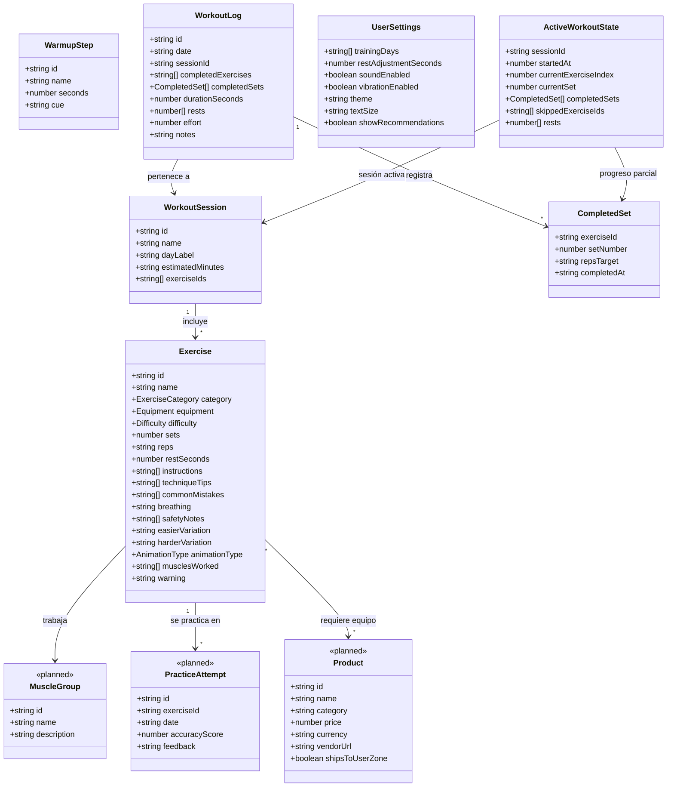

# Modelo de dominio

Diagrama de clases UML (modelo de datos) en formato Mermaid. Incluye las
entidades ya implementadas en el MVP y las planeadas para las próximas
épicas (marcadas como `<<planned>>`).

## Notas

- `MuscleGroup` formaliza lo que hoy es solo el campo de texto
  `ExerciseCategory`, para poder cubrir más grupos musculares además de
  brazos (épica "Expandir a otros grupos musculares").
- `PracticeAttempt` respalda el modo de práctica interactivo tipo juego:
  guarda cada intento simulado y su retroalimentación (épica "Modo de
  práctica interactivo").
- `Product` respalda el perfilado de equipo recomendado con precio y envío
  (épica "Recomendación de productos").
